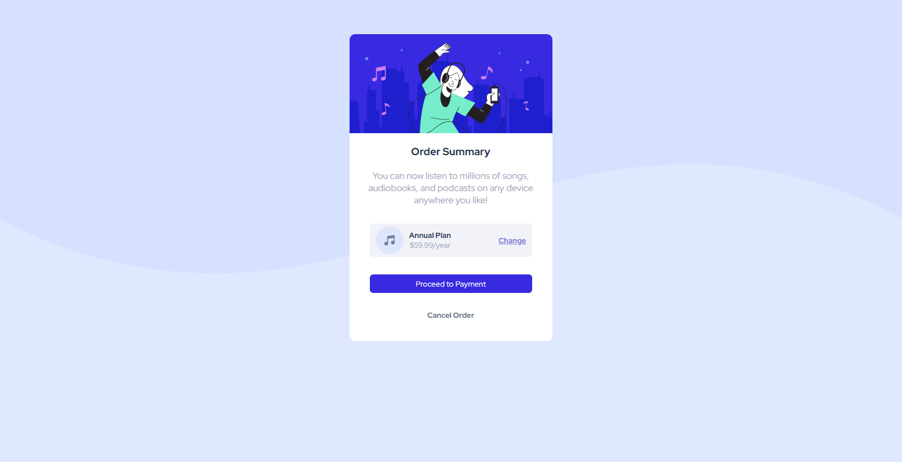

# APP MUSIC

>  The page is an application of a music application.

Check the Application: https://kayke-fujinaka.github.io/music-app/ 
## 📁 Pages

The project has only one page:

- **Home Page:** The page presents a simulation of a music app that has a plan to gain access to.
## :dart: Features ##

:heavy_check_mark: Home page application;\
:heavy_check_mark: Finished;

## :rocket: Technologies ##

The following tools were used in this project:

- [Html](https://developer.mozilla.org/pt-BR/docs/Web/HTML/Element/html/)  
- [CSS](https://developer.mozilla.org/pt-BR/docs/Web/CSS) 
## 🤝 Collaborators

We thank the following people who contributed to this project:

<table>
  <tr>
    <td align="center">
      <a href="#">
         
        
          <b>Kayke Alves Fujinaka</b>
        
      </a>
    </td>
    <td align="center">
      <a href="#">
         
        
          <b>Pedro Henrique da Silva</b>
        
      </a>
    </td>
  </tr>
</table>

## 📝 License

This project is under license. See the [LICENSE](LICENSE.md) file for more details.

&#xa0;

<a href="#top">Back to top</a>

